# DoorKnocker Chatbot — Architecture

> **Status:** Tier 1 live. Tier 2/3 schema and tool registry ready for activation.

---

## Table of Contents

1. [Overview](#overview)
2. [Tier System](#tier-system)
3. [Tech Stack](#tech-stack)
4. [High-Level Architecture](#high-level-architecture)
5. [Request Flow (Per Message)](#request-flow-per-message)
6. [Knowledge Base Pipeline](#knowledge-base-pipeline)
7. [Observability — LangSmith Tracing](#observability--langsmith-tracing)
8. [Conversation History](#conversation-history)
9. [Database Schema](#database-schema)
10. [Frontend Components](#frontend-components)
11. [Review Flow](#review-flow)
12. [Tier 2 / Tier 3 Upgrade Path](#tier-2--tier-3-upgrade-path)
13. [Cost Estimate](#cost-estimate)
14. [Secrets & Config](#secrets--config)

---

## Overview

DoorKnocker includes a floating in-app support chatbot powered by **OpenAI GPT-4o-mini** and **Retrieval Augmented Generation (RAG)** over a Supabase pgvector knowledge base. Every pipeline step is traced in **LangSmith** for observability.

**What it does (Tier 1 — live):**
- Answers questions about the app using a curated human-written knowledge base
- Maintains per-user conversation history across sessions
- Lets users browse and restore past conversations (history panel, like ChatGPT/Claude)
- Asks for a star rating + comment after 6+ exchanges
- Traces every embed/retrieve/generate step to LangSmith for monitoring

**What it will do (Tier 2/3 — architecture ready):**
- Navigate users to specific pages on their behalf
- Perform write actions (create campaigns, manage zones) with confirmation
- Run multi-step agentic workflows

RAG works like this: instead of relying on what GPT already knows (which is nothing about DoorKnocker), we:
1. Write plain-English docs about the app (28 files under `docs/kb/`)
2. Convert them to number vectors (embeddings) that represent meaning
3. Store those vectors in Supabase pgvector
4. At query time, find the docs most similar to the user's question and inject them into the GPT prompt
5. GPT answers using **your docs only** — no hallucination about features that don't exist

---

## Tier System

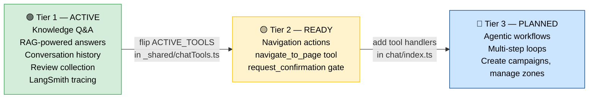

| Tier | `ACTIVE_TOOLS` value | Change needed |
|---|---|---|
| 1 (now) | `TIER_1_TOOLS` (empty array) | — |
| 2 | `TIER_2_TOOLS` | Flip one export in `_shared/chatTools.ts` + add handler cases |
| 3 | Custom multi-step tools | Extend agent loop with `while (finish_reason === "tool_calls")` |

---

## Tech Stack

| Layer | Service | Model / Plan | Cost |
|---|---|---|---|
| LLM | OpenAI Chat | `gpt-4o-mini` | ~$0.15/M input, $0.60/M output |
| Embeddings | OpenAI Embeddings | `text-embedding-3-small` (1536-dim) | ~$0.02/1M tokens |
| Vector DB | Supabase pgvector | HNSW index, cosine similarity | $0 (within plan) |
| Chat history | Supabase Postgres | `chat_sessions`, `chat_messages` | $0 (within plan) |
| Reviews | Supabase Postgres | `reviews` table | $0 (within plan) |
| Backend logic | Supabase Edge Functions | Deno runtime | $0 (within free limits) |
| Streaming | Server-Sent Events (SSE) | — | — |
| Observability | LangSmith | `DoorKnocker` project | Free tier |
| Knowledge base authoring | Notion database | 29 pages, 10 categories | $0 |
| Knowledge base storage | Supabase pgvector | Synced from Notion via embed script | $0 |
| Optional review sync | Notion API | Requires `NOTION_TOKEN` + `NOTION_DATABASE_ID` | $0 |
| Frontend | React + Vite | Single custom component, no third-party chat UI | $0 |

---

## High-Level Architecture

```mermaid
graph TB
    subgraph Frontend ["Frontend — React App (Vite)"]
        DKC["DoorKnockerChat.tsx\nfloating button + full chat panel\n• drag-to-resize\n• history panel view\n• SSE streaming\n• ReactMarkdown rendering"]
        RP["ReviewPrompt.tsx\n(star rating)"]
        LS["localStorage\ndk_chat_session_id\ndk_chat_open\ndk_chat_size"]

        DKC --> RP
        DKC --> LS
    end

    subgraph EdgeFunctions ["Supabase Edge Functions (Deno)"]
        CF["chat/index.ts\nMain RAG orchestrator\n+ LangSmith traceable wrappers"]
        GH["getChatHistory/index.ts\nLoad session messages on open"]
        GS["getChatSessions/index.ts\nList user's past sessions"]
        SR["submitReview/index.ts\nSave ratings"]
        CT["_shared/chatTools.ts\nTool registry"]
        CF --> CT
    end

    subgraph LangSmith ["LangSmith (smith.langchain.com)"]
        LS_PROJ["DoorKnocker project\nTraces: embed → retrieve → generate\nLatency, token cost, inputs/outputs"]
    end

    subgraph OpenAI ["OpenAI APIs"]
        EMB["Embeddings API\ntext-embedding-3-small"]
        GPT["Chat Completions API\ngpt-4o-mini + streaming"]
    end

    subgraph Supabase ["Supabase (Postgres + pgvector)"]
        KC["knowledge_chunks\nSynced from Notion\nsource_file: notion/<page-id>"]
        CS["chat_sessions\nper-user threads"]
        CH["chat_messages\nfull history"]
        RV["reviews\nstar ratings"]
        MS["match_knowledge_chunks()\nHNSW cosine similarity\nthreshold: 0.25, top-8"]
        GUS["get_user_chat_sessions()\nSQL helper — last 20 sessions\nwith title + message count"]
    end

    subgraph Notion ["Notion (optional)"]
        NDB["Reviews database\nNOTION_DATABASE_ID"]
    end

    DKC -->|"POST /functions/v1/chat\nBearer JWT + message"| CF
    DKC -->|"GET /functions/v1/getChatHistory\n?session_id=xxx"| GH
    DKC -->|"GET /functions/v1/getChatSessions"| GS
    DKC -->|"POST /functions/v1/submitReview\nrating + comment"| SR

    CF -->|"embed-query (traceable)"| EMB
    CF -->|"retrieve-chunks (traceable)"| MS
    MS --> KC
    CF -->|"generate-response (traceable)"| GPT
    CF -->|"read/write"| CS
    CF -->|"read/write"| CH
    CF -->|"SSE delta chunks"| DKC
    CF -.->|"trace events"| LS_PROJ

    GH -->|"SELECT messages"| CH
    GS -->|"rpc"| GUS
    GUS --> CS
    GUS --> CH

    SR -->|"insert"| RV
    SR -->|"optional sync"| NDB

    style Frontend fill:#e8f4f8,stroke:#0288d1,color:#000
    style EdgeFunctions fill:#f3e5f5,stroke:#7b1fa2,color:#000
    style LangSmith fill:#ffe8cc,stroke:#e67e00,color:#000
    style OpenAI fill:#fff8e1,stroke:#f57f17,color:#000
    style Supabase fill:#e8f5e9,stroke:#2e7d32,color:#000
    style Notion fill:#fce4ec,stroke:#c62828,color:#000
```

---

## Request Flow (Per Message)

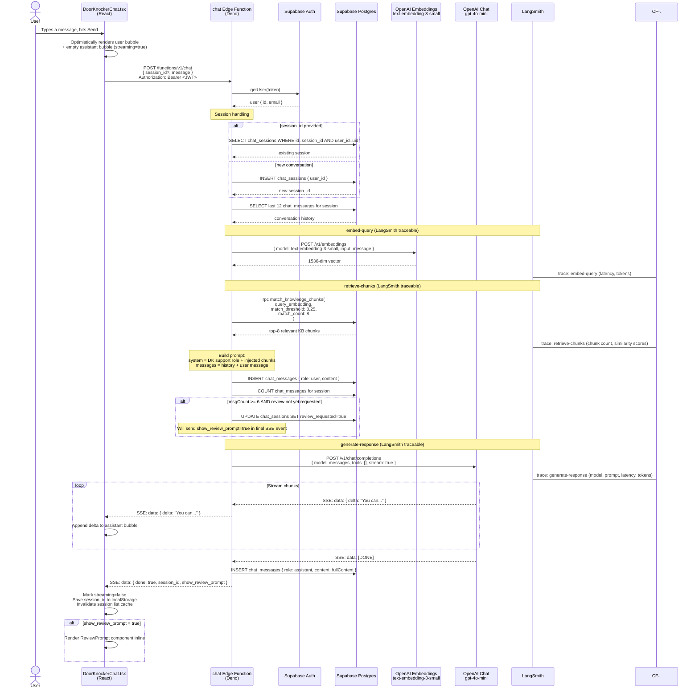

---

## Knowledge Base Pipeline

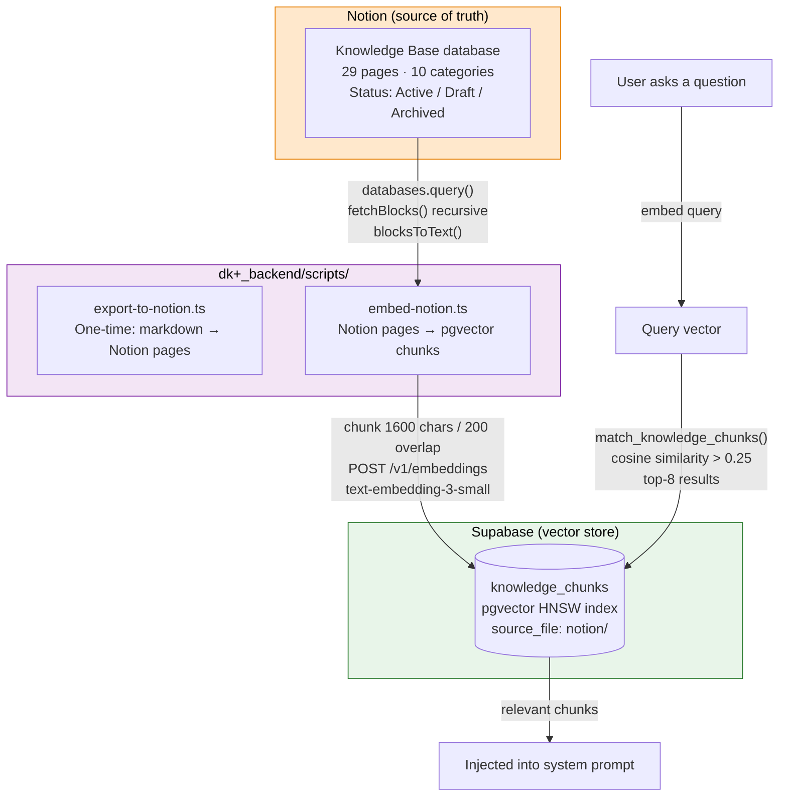

**Notion database structure:**

| Property | Type | Values |
|---|---|---|
| Name | Title | Article title |
| Category | Select | Product · Campaigns · Targeting · Templates · Analytics · Referrals · Team & Roles · Agency · Settings & Account · Support |
| Status | Select | **Active** (embedded) · Draft (skipped) · Archived (skipped) |

Page body contains the full KB content as Notion blocks (headings, bullets, tables, code blocks).

**Adding / editing KB content:**

1. Open the Notion database and edit or create a page
2. Set Status = **Active**
3. Re-run the embed script — only that page's chunks are replaced

```bash
cd dk+_backend/scripts
NOTION_TOKEN=ntn_... \
NOTION_DATABASE_ID=383b289c05d380caa9c3cc90727ee532 \
OPENAI_API_KEY=sk-... \
SUPABASE_URL=https://xnflihspegizweqidvow.supabase.co \
SUPABASE_SERVICE_KEY=eyJ... \
npm run embed:notion
```

**First-time full sync (or after bulk edits):**

```bash
# Add CLEAR_EXISTING=true to wipe and re-embed everything from scratch
CLEAR_EXISTING=true ... npm run embed:notion
```

**One-time export (already done — do not re-run unless rebuilding from scratch):**

```bash
# Exports docs/kb/ markdown files to Notion. Skip if Notion already has content.
NOTION_TOKEN=ntn_... NOTION_DATABASE_ID=... npm run export:notion
```

No redeployment needed. The Edge Function always queries live pgvector.

---

## Observability — LangSmith Tracing

Every message processed by the `chat` Edge Function produces a trace in **LangSmith** (`smith.langchain.com`, project: `DoorKnocker`). Each trace contains three nested spans:

| Span | `runType` | What it captures |
|---|---|---|
| `embed-query` | `embedding` | Input text, output vector dimensions, latency, token count |
| `retrieve-chunks` | `retrieval` | Query embedding, matched chunk count, similarity scores |
| `generate-response` | `llm` | Full prompt (system + history + user), streamed output, model, latency, token cost |

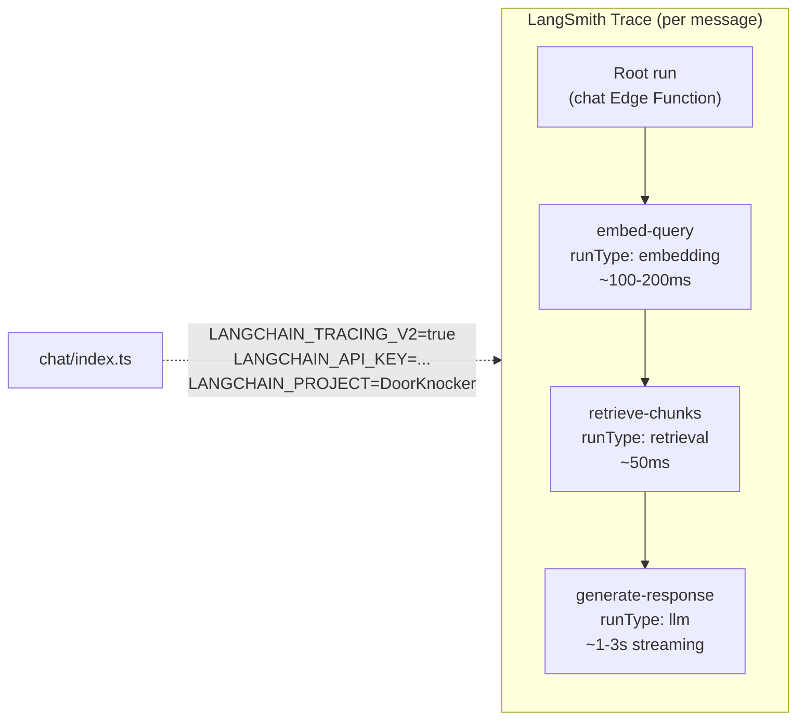

**How it's implemented** — `npm:langsmith/traceable` wraps each pipeline step:

```typescript
import { traceable } from "npm:langsmith/traceable";

const embedQuery   = traceable(async (msg) => { ... }, { name: "embed-query",   runType: "embedding" });
const retrieveChunks = traceable(async (sb, emb) => { ... }, { name: "retrieve-chunks", runType: "retrieval" });
const generateResponse = traceable(async (msgs) => { ... }, { name: "generate-response", runType: "llm" });
```

LangSmith auto-detects `LANGCHAIN_TRACING_V2=true` and `LANGCHAIN_API_KEY` from the Supabase Edge Function environment — no SDK initialization needed.

---

## Conversation History

Users can browse and restore past conversations from within the chat widget — similar to ChatGPT or Claude.

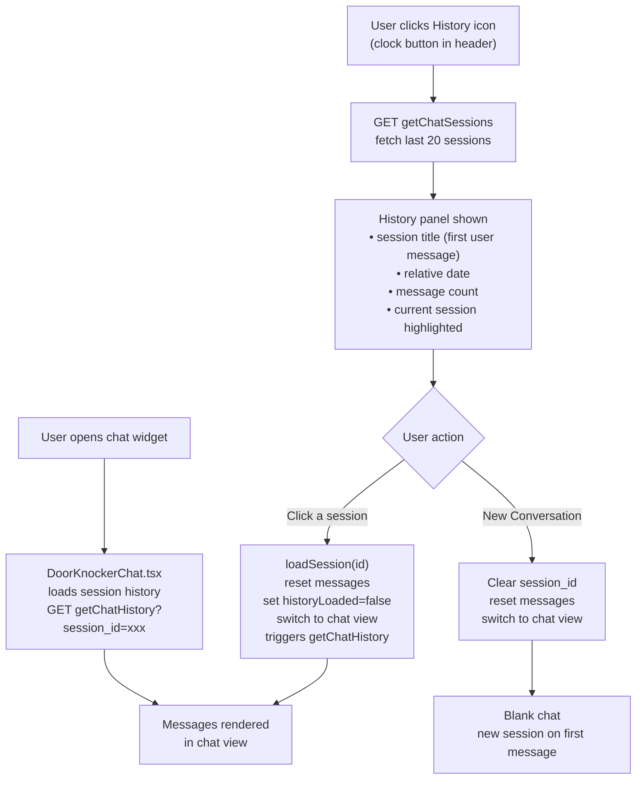

**New Edge Functions supporting history:**

| Function | Method | Description |
|---|---|---|
| `getChatHistory` | `GET ?session_id=xxx` | Returns all messages for a session (auth-scoped) |
| `getChatSessions` | `GET` | Returns last 20 sessions with title + message count |

**`get_user_chat_sessions` SQL helper** (`migrations/20260618000000_chat_sessions_helper.sql`):
```sql
-- Derives session title from first user message (max 60 chars)
-- Returns: id, created_at, title, message_count
-- SECURITY DEFINER so Edge Function can call with service role
SELECT cs.id, cs.created_at,
  LEFT(COALESCE(
    (SELECT content FROM chat_messages WHERE session_id = cs.id AND role='user'
     ORDER BY created_at ASC LIMIT 1),
    'New conversation'), 60) AS title,
  (SELECT COUNT(*) FROM chat_messages WHERE session_id = cs.id) AS message_count
FROM chat_sessions cs
WHERE cs.user_id = p_user_id
ORDER BY cs.created_at DESC LIMIT 20;
```

---

## Database Schema

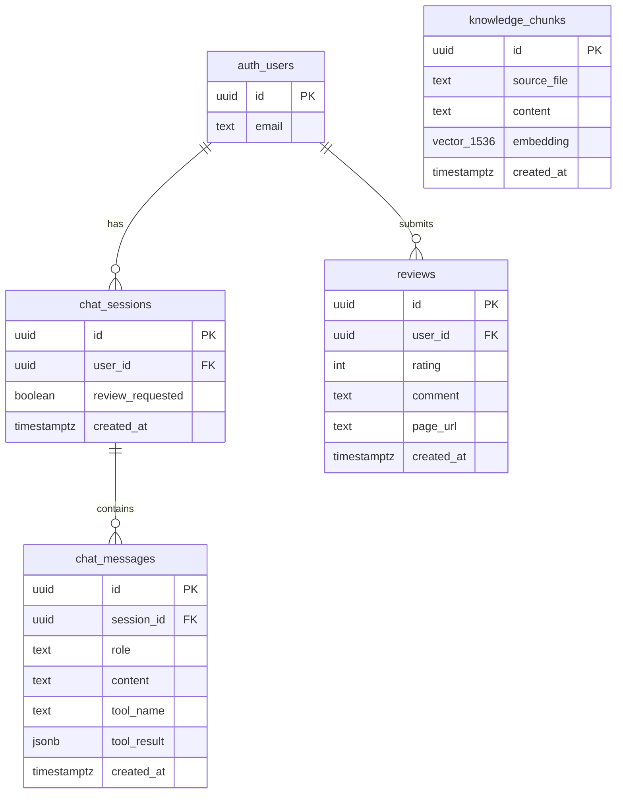

**Key design decisions:**

| Decision | Reason |
|---|---|
| `tool_name` + `tool_result` columns on `chat_messages` | Tier 2/3 tool call results stored without schema change |
| `review_requested` boolean on `chat_sessions` | Prevents double-prompting on same session |
| HNSW index on `embedding` | Sub-millisecond similarity search at scale |
| Cosine similarity threshold 0.25 | Lowered from 0.4 — catches semantically related content that was previously excluded |
| Top-8 retrieved chunks | Raised from 5 — more context coverage for complex multi-part questions |
| Last 12 messages in history | Balances context quality vs token cost |
| `get_user_chat_sessions` SECURITY DEFINER function | Lets Edge Function aggregate title + count in one RPC without exposing raw table access |

**RLS Policies:**

| Table | Policy |
|---|---|
| `knowledge_chunks` | Authenticated users can SELECT (read-only, no client writes) |
| `chat_sessions` | Users can SELECT/UPDATE own rows only (`user_id = auth.uid()`) |
| `chat_messages` | Users can SELECT messages from sessions they own (subquery join) |
| `reviews` | Users can SELECT and INSERT own rows |
| All tables | Service role (Edge Functions) bypasses RLS entirely |

---

## Frontend Components

The entire chat system is a single self-contained component. All previous files (`ChatWidget.tsx`, `ChatDrawer.tsx`, `ChatMessage.tsx`, `useChat.ts`) have been replaced.

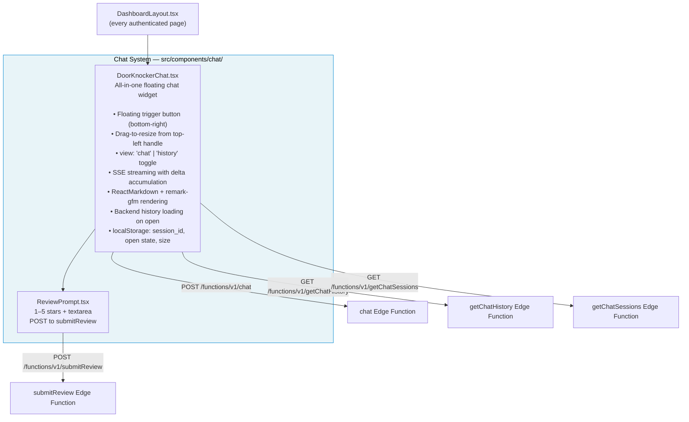

**State managed inside `DoorKnockerChat.tsx`:**

| State | Type | Purpose |
|---|---|---|
| `open` | `boolean` | Panel open/closed (persisted to `localStorage`) |
| `view` | `"chat" \| "history"` | Which panel is showing |
| `messages` | `Message[]` | Current session messages |
| `input` | `string` | Textarea value |
| `isStreaming` | `boolean` | Disables send while response is streaming |
| `historyLoaded` | `boolean` | Guards history fetch on session open |
| `showReview` | `boolean` | Triggers inline review prompt |
| `sessions` | `Session[]` | History panel session list |
| `sessionsLoaded` | `boolean` | Guards session list fetch on history open |
| `sessionIdRef` | `RefObject<string>` | Current session UUID (backed by `localStorage`) |
| `size` | `{w, h}` | Widget dimensions (persisted to `localStorage`) |

---

## Review Flow

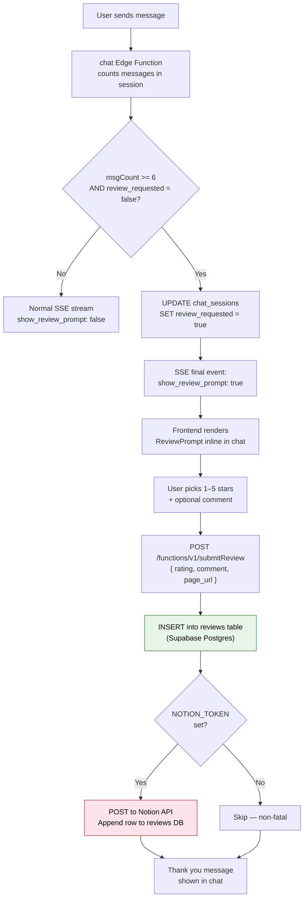

---

## Tier 2 / Tier 3 Upgrade Path

### Activating Tier 2 (Navigation + Confirmation)

**Step 1** — Flip one line in [`supabase/functions/_shared/chatTools.ts`](../supabase/functions/_shared/chatTools.ts):

```typescript
// Before (Tier 1):
export const ACTIVE_TOOLS = TIER_1_TOOLS;

// After (Tier 2):
export const ACTIVE_TOOLS = TIER_2_TOOLS;
```

**Step 2** — Add a tool execution handler in `chat/index.ts` inside an agent loop:

```typescript
while (true) {
  const response = await callOpenAI(messages, ACTIVE_TOOLS);

  if (response.finish_reason === "tool_calls") {
    for (const toolCall of response.tool_calls) {
      let result;
      switch (toolCall.function.name) {
        case "navigate_to_page":
          result = { navigated: true, path: toolCall.function.arguments.path };
          break;
        case "request_confirmation":
          result = { awaiting_confirmation: true };
          break;
      }
      messages.push({ role: "tool", tool_call_id: toolCall.id, content: JSON.stringify(result) });
    }
    continue;
  }

  streamToClient(response.content);
  break;
}
```

**Step 3** — `supabase functions deploy chat`

```mermaid
flowchart LR
    A["User: 'take me to campaigns'"] --> B["GPT sees TIER_2_TOOLS\nin the prompt"]
    B --> C["finish_reason: tool_calls\nnavigate_to_page: /campaigns/create"]
    C --> D["Edge Function intercepts\nexecutes tool logic"]
    D --> E["Tool result fed back to GPT"]
    E --> F["GPT generates\nconfirmation text"]
    F --> G["Streamed to user\n'Taking you to Create Campaign...'"]
    G --> H["Frontend receives\nnavigation SSE event"]
    H --> I["react-router navigate()"]

    style C fill:#fff3cd,stroke:#ffc107,color:#000
    style D fill:#f3e5f5,stroke:#7b1fa2,color:#000
```

### Tier 3 — Agentic Workflows

Same loop, longer chains. Example: "Create a campaign targeting downtown Austin":

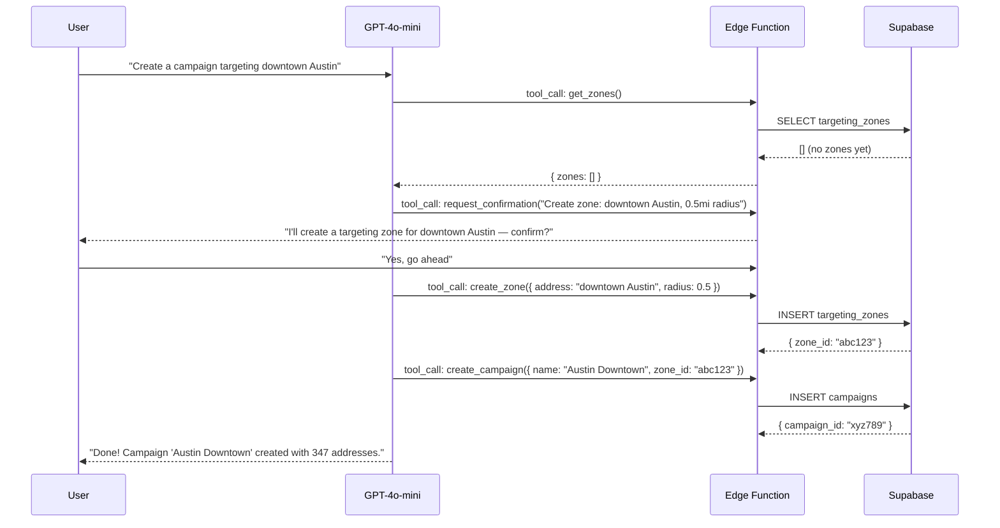

---

## Cost Estimate

| Usage level | Messages/day | Monthly OpenAI cost |
|---|---|---|
| Low (pilot) | 50 | ~$0.50 |
| Medium (active) | 500 | ~$5.00 |
| High (scale) | 5,000 | ~$50.00 |

*Based on avg ~1,500 input tokens + ~300 output tokens per message at gpt-4o-mini rates.*

Embeddings: one-time cost of ~$0.0001 to embed all docs. Re-embedding on doc updates costs the same.

LangSmith: free tier covers up to 5,000 traces/month.

---

## Secrets & Config

| Secret | Where set | Used by |
|---|---|---|
| `OPENAI_API_KEY` | `supabase secrets set` | `chat` function (embed + chat) |
| `LANGCHAIN_API_KEY` | `supabase secrets set` | `chat` function (LangSmith tracing) |
| `LANGCHAIN_TRACING_V2` | `supabase secrets set` (value: `true`) | `chat` function |
| `LANGCHAIN_PROJECT` | `supabase secrets set` (value: `DoorKnocker`) | `chat` function |
| `NOTION_TOKEN` | `supabase secrets set` | `submitReview` (optional) |
| `NOTION_DATABASE_ID` | `supabase secrets set` | `submitReview` (optional) |
| `VITE_SUPABASE_URL` | Frontend `.env` | `DoorKnockerChat.tsx` |
| `VITE_SUPABASE_ANON_KEY` | Frontend `.env` | All Supabase client calls |

**Deploying updates:**

```bash
# Redeploy after any backend change
cd dk+_backend
supabase functions deploy chat
supabase functions deploy getChatSessions
supabase functions deploy getChatHistory
supabase functions deploy submitReview

# Sync knowledge base after editing pages in Notion
cd dk+_backend/scripts
NOTION_TOKEN=ntn_... \
NOTION_DATABASE_ID=383b289c05d380caa9c3cc90727ee532 \
OPENAI_API_KEY=sk-... \
SUPABASE_URL=https://xnflihspegizweqidvow.supabase.co \
SUPABASE_SERVICE_KEY=eyJ... \
npm run embed:notion
```
