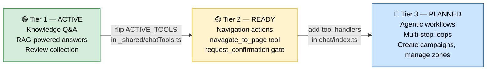
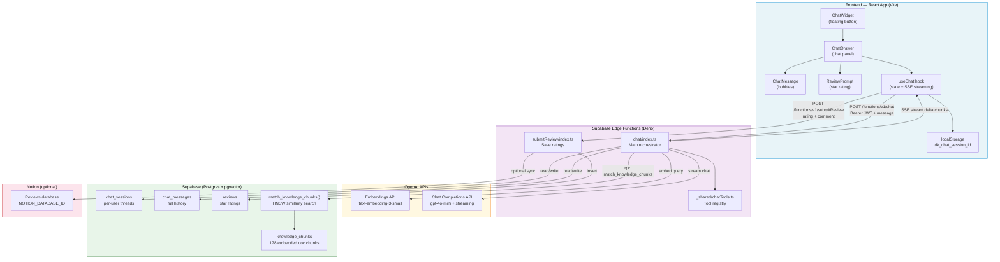
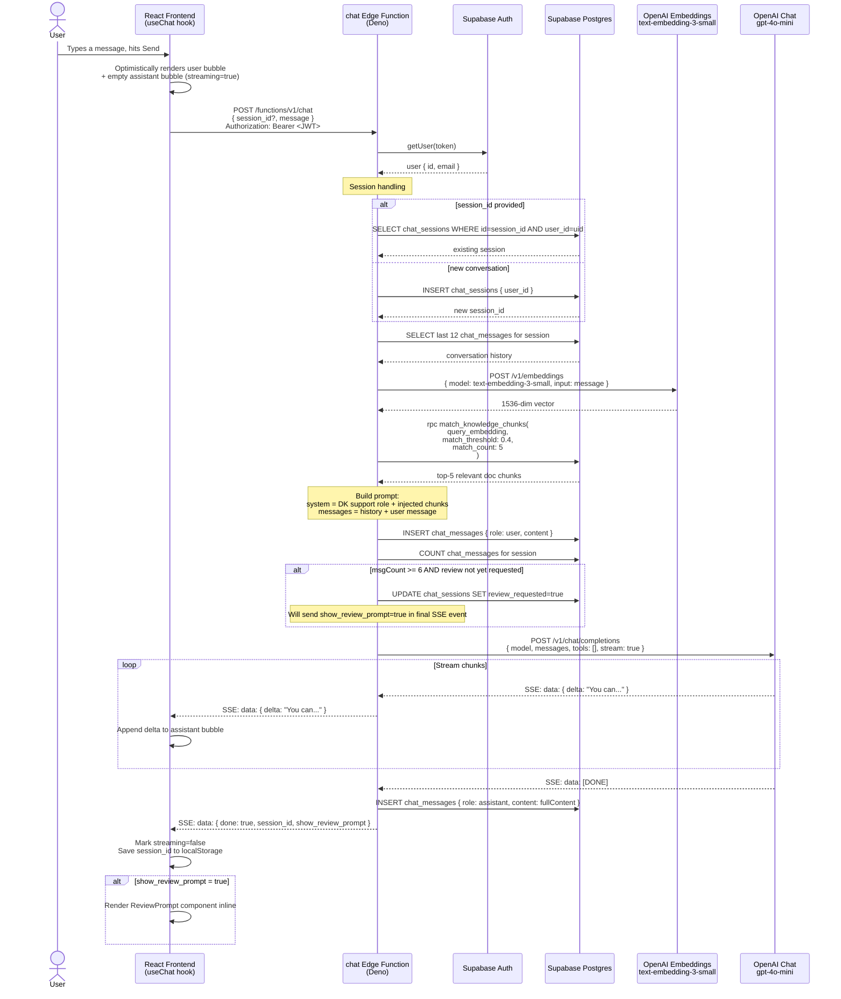
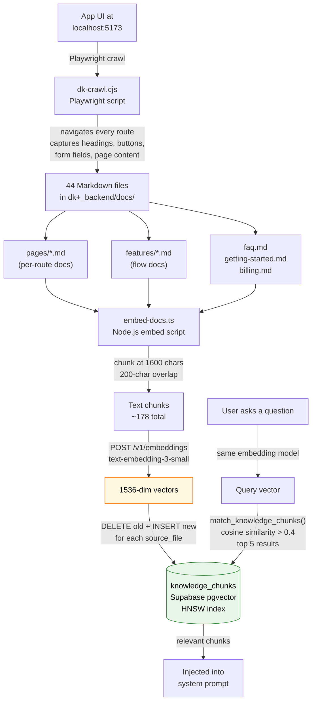
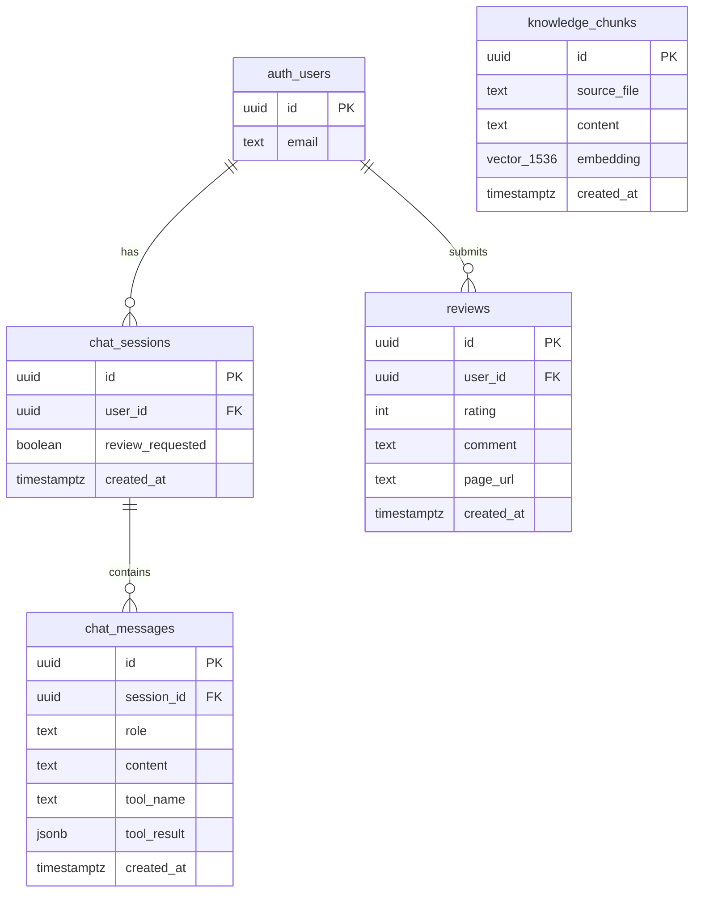
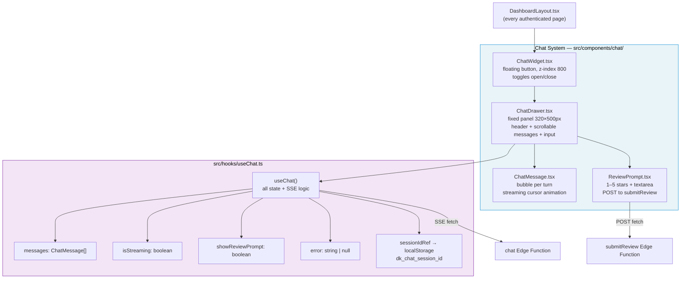
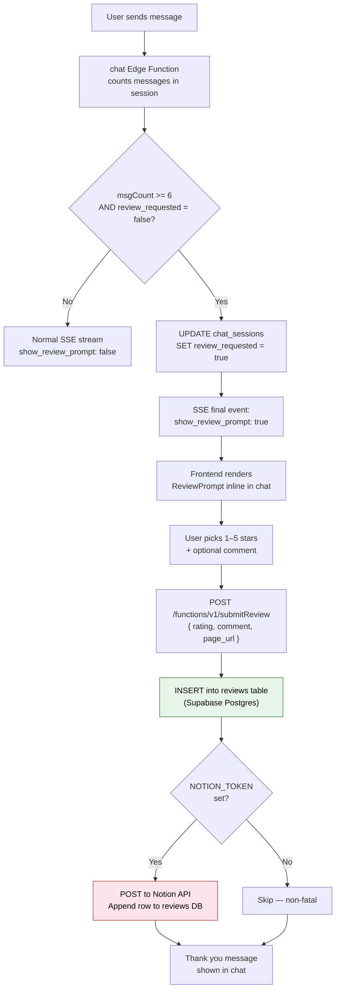
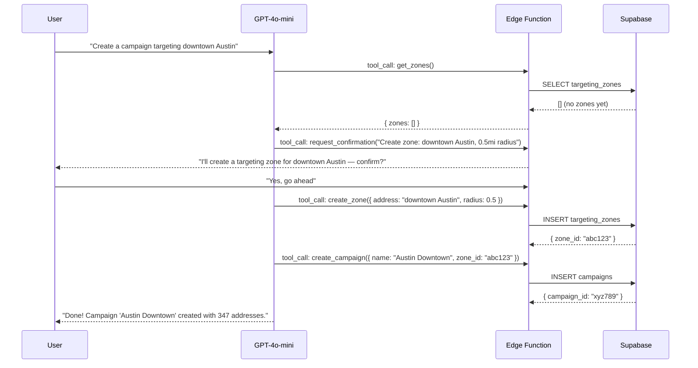

# DoorKnocker Chatbot — Architecture

> **Status:** Tier 1 live. Tier 2/3 schema and tool registry ready for activation.

---

## Table of Contents

1. [Overview](#overview)
2. [Tier System](#tier-system)
3. [Tech Stack](#tech-stack)
4. [High-Level Architecture](#high-level-architecture)
5. [Request Flow (Per Message)](#request-flow-per-message)
6. [Knowledge Base Pipeline](#knowledge-base-pipeline)
7. [Database Schema](#database-schema)
8. [Frontend Components](#frontend-components)
9. [Review Flow](#review-flow)
10. [Tier 2 / Tier 3 Upgrade Path](#tier-2--tier-3-upgrade-path)
11. [Cost Estimate](#cost-estimate)
12. [Secrets & Config](#secrets--config)

---

## Overview

DoorKnocker includes a floating in-app support chatbot powered by **OpenAI GPT-4o-mini** and **Retrieval Augmented Generation (RAG)** over a Supabase pgvector knowledge base.

**What it does (Tier 1 — live):**
- Answers questions about the app using the embedded knowledge base
- Maintains per-user conversation history across sessions
- Asks for a star rating + comment after 6+ exchanges

**What it will do (Tier 2/3 — architecture ready):**
- Navigate users to specific pages on their behalf
- Perform write actions (create campaigns, manage zones) with confirmation
- Run multi-step agentic workflows

RAG works like this: instead of relying on what GPT already knows (which is nothing about DoorKnocker), we:
1. Write plain-English docs about the app
2. Convert them to number vectors (embeddings) that represent meaning
3. Store those vectors in Supabase pgvector
4. At query time, find the docs most similar to the user's question and inject them into the GPT prompt
5. GPT answers using **your docs only** — no hallucination about features that don't exist

---

## Tier System



| Tier | `ACTIVE_TOOLS` value | Change needed |
|---|---|---|
| 1 (now) | `TIER_1_TOOLS` (empty array) | — |
| 2 | `TIER_2_TOOLS` | Flip one export in `_shared/chatTools.ts` + add handler cases |
| 3 | Custom multi-step tools | Extend agent loop with `while (finish_reason === "tool_calls")` |

---

## Tech Stack

| Layer | Service | Model / Plan | Cost |
|---|---|---|---|
| LLM | OpenAI Chat | `gpt-4o-mini` | ~$0.15/M input, $0.60/M output |
| Embeddings | OpenAI Embeddings | `text-embedding-3-small` (1536-dim) | ~$0.02/1M tokens |
| Vector DB | Supabase pgvector | HNSW index, cosine similarity | $0 (within plan) |
| Chat history | Supabase Postgres | `chat_sessions`, `chat_messages` | $0 (within plan) |
| Reviews | Supabase Postgres | `reviews` table | $0 (within plan) |
| Backend logic | Supabase Edge Functions | Deno runtime | $0 (within free limits) |
| Streaming | Server-Sent Events (SSE) | — | — |
| Knowledge base | Markdown files in repo | 44 docs / 178 chunks | $0 |
| Optional review sync | Notion API | Requires `NOTION_TOKEN` + `NOTION_DATABASE_ID` | $0 |
| Frontend | React + Vite | Custom hooks + components | $0 |

---

## High-Level Architecture



---

## Request Flow (Per Message)



---

## Knowledge Base Pipeline



**Updating the knowledge base:**

```bash
# 1. Edit any .md file in dk+_backend/docs/
# 2. Re-run the embed script — changes are live immediately

cd dk+_backend/scripts
OPENAI_API_KEY=sk-... \
SUPABASE_URL=https://xnflihspegizweqidvow.supabase.co \
SUPABASE_SERVICE_KEY=eyJ... \
npm run embed
```

No redeployment needed. The Edge Function always queries live pgvector.

---

## Database Schema



**Key design decisions:**

| Decision | Reason |
|---|---|
| `tool_name` + `tool_result` columns on `chat_messages` | Tier 2/3 tool call results stored without schema change |
| `review_requested` boolean on `chat_sessions` | Prevents double-prompting on same session |
| HNSW index on `embedding` | Sub-millisecond similarity search at scale |
| Cosine similarity threshold 0.4 | Low enough to catch related content, high enough to avoid noise |
| Last 12 messages in history | Balances context quality vs token cost |

**RLS Policies:**

| Table | Policy |
|---|---|
| `knowledge_chunks` | Authenticated users can SELECT (read-only, no client writes) |
| `chat_sessions` | Users can SELECT/UPDATE own rows only (`user_id = auth.uid()`) |
| `chat_messages` | Users can SELECT messages from sessions they own (subquery join) |
| `reviews` | Users can SELECT and INSERT own rows |
| All tables | Service role (Edge Functions) bypasses RLS entirely |

---

## Frontend Components



**Session persistence:** `sessionIdRef` holds the UUID in memory and is backed by `localStorage['dk_chat_session_id']`. On reload, the existing session ID is sent to the Edge Function, which loads history from `chat_messages`. If the session is deleted or expired, a new one is created.

---

## Review Flow



---

## Tier 2 / Tier 3 Upgrade Path

### Activating Tier 2 (Navigation + Confirmation)

**Step 1** — Flip one line in [`supabase/functions/_shared/chatTools.ts`](../supabase/functions/_shared/chatTools.ts):

```typescript
// Before (Tier 1):
export const ACTIVE_TOOLS = TIER_1_TOOLS;

// After (Tier 2):
export const ACTIVE_TOOLS = TIER_2_TOOLS;
```

**Step 2** — Add a tool execution handler in `chat/index.ts` inside an agent loop:

```typescript
// Agent loop — runs until GPT stops calling tools
while (true) {
  const response = await callOpenAI(messages, ACTIVE_TOOLS);

  if (response.finish_reason === "tool_calls") {
    for (const toolCall of response.tool_calls) {
      let result;

      switch (toolCall.function.name) {
        case "navigate_to_page":
          // Stream a special SSE event the frontend intercepts to navigate
          result = { navigated: true, path: toolCall.function.arguments.path };
          break;

        case "request_confirmation":
          // Pause and ask user to confirm — frontend shows [Confirm] / [Cancel]
          result = { awaiting_confirmation: true };
          break;
      }

      messages.push({ role: "tool", tool_call_id: toolCall.id, content: JSON.stringify(result) });
    }
    continue; // loop back — GPT sees tool results and responds
  }

  // No tool calls — stream text back to user and break
  streamToClient(response.content);
  break;
}
```

**Step 3** — `supabase functions deploy chat`

```mermaid
flowchart LR
    A["User: 'take me to campaigns'"] --> B["GPT sees TIER_2_TOOLS\nin the prompt"]
    B --> C["finish_reason: tool_calls\nnavigate_to_page: /campaigns/create"]
    C --> D["Edge Function intercepts\nexecutes tool logic"]
    D --> E["Tool result fed back to GPT"]
    E --> F["GPT generates\nconfirmation text"]
    F --> G["Streamed to user\n'Taking you to Create Campaign...'"]
    G --> H["Frontend receives\nnavigation SSE event"]
    H --> I["react-router navigate()"]

    style C fill:#fff3cd,stroke:#ffc107,color:#000
    style D fill:#f3e5f5,stroke:#7b1fa2,color:#000
```



### Tier 3 — Agentic Workflows

Same loop, longer chains. Example: "Create a campaign targeting downtown Austin":



---

## Cost Estimate

| Usage level | Messages/day | Monthly OpenAI cost |
|---|---|---|
| Low (pilot) | 50 | ~$0.50 |
| Medium (active) | 500 | ~$5.00 |
| High (scale) | 5,000 | ~$50.00 |

*Based on avg ~1,500 input tokens + ~300 output tokens per message at gpt-4o-mini rates.*

Embeddings: one-time cost of ~$0.0001 to embed all 178 chunks. Re-embedding on doc updates costs the same.

---

## Secrets & Config

| Secret | Where set | Used by |
|---|---|---|
| `OPENAI_API_KEY` | `supabase secrets set OPENAI_API_KEY=sk-...` | `chat` function (embed + chat) |
| `NOTION_TOKEN` | `supabase secrets set NOTION_TOKEN=secret_...` | `submitReview` (optional) |
| `NOTION_DATABASE_ID` | `supabase secrets set NOTION_DATABASE_ID=abc123` | `submitReview` (optional) |
| `VITE_SUPABASE_URL` | Frontend `.env` | `useChat` hook |
| `VITE_SUPABASE_ANON_KEY` | Frontend `.env` | All Supabase client calls |

**Deploying updates:**

```bash
# Redeploy chat function after any backend change
cd dk+_backend
supabase functions deploy chat
supabase functions deploy submitReview

# Rebuild knowledge base after editing docs
cd dk+_backend/scripts
OPENAI_API_KEY=sk-... SUPABASE_URL=... SUPABASE_SERVICE_KEY=... npm run embed
```
