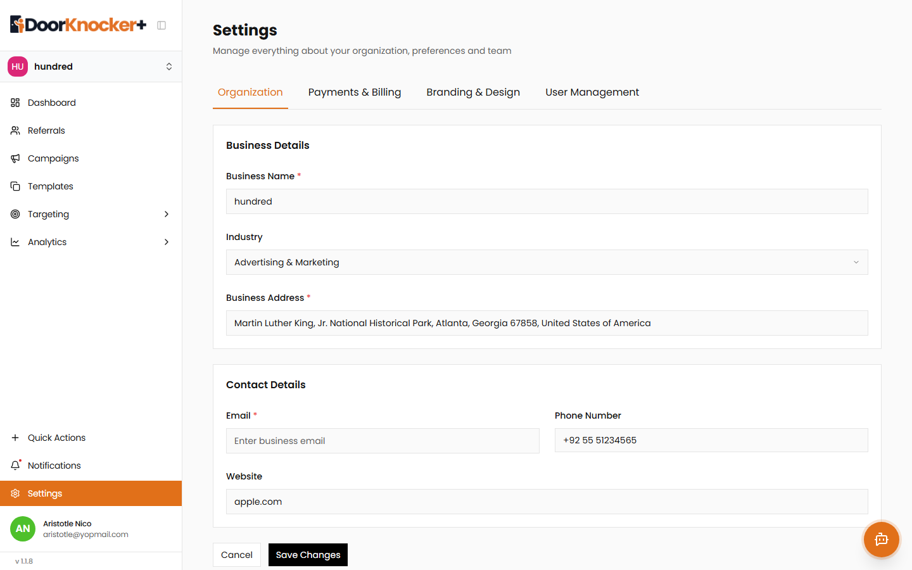
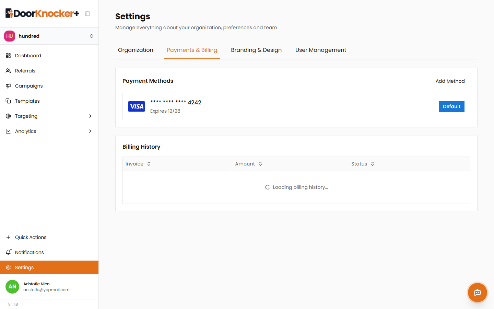
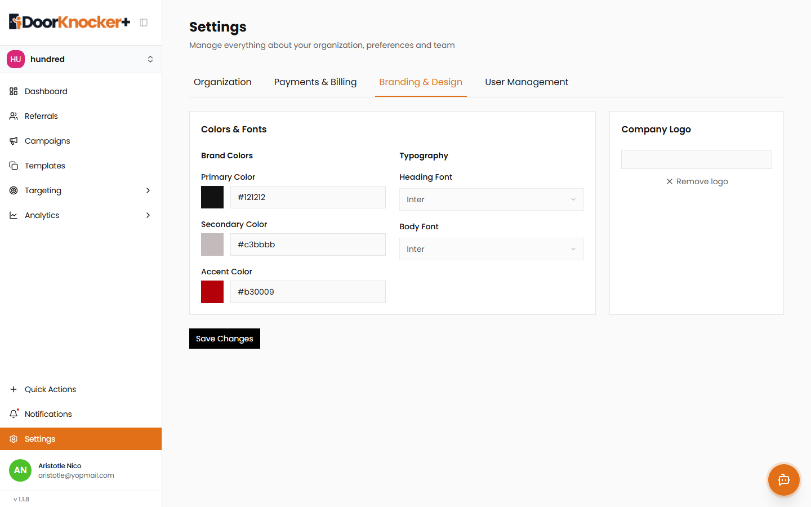
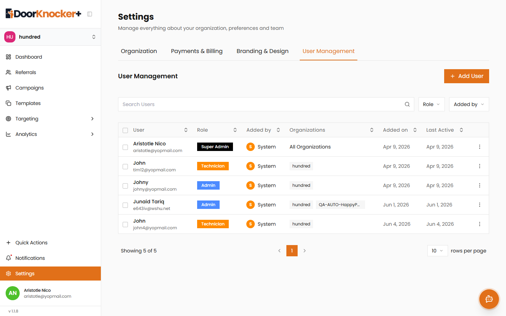

# Settings

## Introduction

The **Settings** module is where you manage everything about your organization: its business details, **payment methods & billing**, **branding** (colors, fonts, logo), and **users**. Settings is organized into four tabs:

1. **Organization**
2. **Payments & Billing**
3. **Branding & Design**
4. **User Management**

To open Settings, click **Settings** in the left sidebar.

---

## A. Organization

### Introduction
The Organization tab holds your business identity — name, industry, address, and contact details — and the option to delete the organization.

### Steps
1. Go to **Settings → Organization** (the default tab).
2. Update **Business Details** and **Contact Details** as needed.
3. Click **Save Changes** (or **Cancel** to discard).

### Fields

| Field | Type | Required | Example |
|-------|------|:--------:|---------|
| Business Name | Text | ✔ | "hundred" |
| Industry | Dropdown | ✖ | "Advertising & Marketing" |
| Business Address | Text | ✔ | "Martin Luther King, Jr. … Atlanta, Georgia 67858, USA" |
| Email | Email | ✔ | "contact@business.com" |
| Phone Number | Phone | ✖ | "+92 55 51234565" |
| Website | URL | ✖ | "apple.com" |

### Danger zone — Delete Organization
- **Delete Organization** permanently removes **all data** — referrals, campaigns, templates, and analytics. Use with extreme caution.

### Pops / Screenshots

**Screenshot A1: Organization settings**
Business and contact details with **Save Changes**, and the **Delete Organization** danger zone.

---

## B. Payments & Billing

### Introduction
Manage the payment methods used for validation and campaign launches (processed via **Stripe**), and review your billing history.

### Steps
1. Go to **Settings → Payments & Billing**.
2. Under **Payment Methods**, review saved cards or click **Add Method** to add one.
   - Each card shows the masked number, expiry, and whether it's the **Default**.
3. Review **Billing History** — a table of **Invoice**, **Amount**, and **Status**.

### Pops / Screenshots

**Screenshot B1: Payments & Billing**
Saved payment methods (e.g., a default card ending in 4242) and the billing history table.

---

## C. Branding & Design

### Introduction
Set your organization's brand colors and typography and upload a logo, so designs reflect your brand.

### Steps
1. Go to **Settings → Branding & Design**.
2. Set **Brand Colors** — **Primary**, **Secondary**, and **Accent** (color picker or hex value).
3. Set **Typography** — **Heading Font** and **Body Font**.
4. Upload or **Remove logo** under **Company Logo**.
5. Click **Save Changes**.

### Fields

| Field | Type | Example |
|-------|------|---------|
| Primary Color | Color / hex | `#E36A00` |
| Secondary Color | Color / hex | `#1D1D20` |
| Accent Color | Color / hex | `#47BAD7` |
| Heading Font | Font select | "Poppins" |
| Body Font | Font select | "Poppins" |
| Company Logo | Image upload | — |

### Pops / Screenshots

**Screenshot C1: Branding & Design**
Brand color pickers, font selectors, and the company logo controls.

---

## D. User Management

### Introduction
Invite and manage the people who can access your organization, and see their roles.

### Steps
1. Go to **Settings → User Management**.
2. Review the user table: **User, Role, Added by, Organizations, Added on, Last Active**.
3. Use **Search Users** to find someone.
4. Click **Add User** to invite a new person.

### Roles

| Role | Scope |
|------|-------|
| **Super Admin** | Full access across **all organizations**. |
| **Admin** | Full access within the organization. |
| **Technician** | Limited, operational/field access. |

### Pops / Screenshots

**Screenshot D1: User Management**
The user list with roles (Super Admin, Admin, Technician), organizations, and activity, plus **Add User**.

---

## Business & validation rules

- **Business Name**, **Business Address**, and **Email** are required on the Organization tab.
- **Deleting an organization is irreversible** and removes all associated data.
- Payment methods are required to validate addresses and launch campaigns (Stripe).
- A user's **role** determines what they can see and do (see the role table above).

## Finalization

After updating Settings:
- Organization, branding, billing, and user changes are saved and applied across the app.

## Expected Result

Your organization's profile, payment methods, brand styling, and team access are configured correctly and reflected throughout DoorKnocker Plus.
