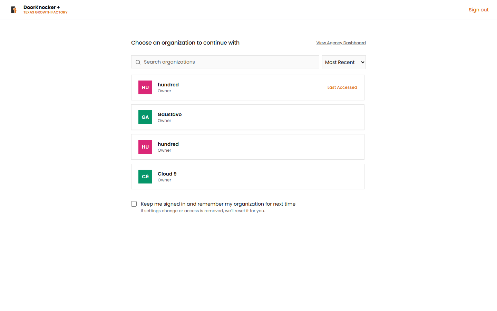

# DoorKnocker Plus — User Documentation

**Application:** DoorKnocker Plus (by Texas Growth Factory)
**Environment documented:** https://door-knocker-plus-dev.vercel.app — version 1.1.8
**Audience:** End users
**Last updated:** June 19, 2026

---

## What is DoorKnocker Plus?

DoorKnocker Plus is a **direct‑mail marketing platform** that lets local businesses design, target, pay for, and launch **physical postcard campaigns** — and then track how recipients respond. Instead of knocking on doors, you reach the right neighborhoods by mail, and a QR code on every postcard lets you measure scans, leads, and delivery in real time.

A typical user:
1. Adds a **Referral** (a past customer / job) or chooses a **target area**.
2. Picks a **postcard Template** (or designs one in the editor).
3. Builds a **Campaign**, targets addresses by radius or count, validates them, pays, and launches.
4. Watches results on the **Dashboard** and **Analytics**.

---

## Who uses it

DoorKnocker Plus is **multi‑organization**. After login you choose which organization (business) to work in. Within an organization, users hold one of these roles (seen under **Settings → User Management**):

| Role | Typical capabilities |
|------|----------------------|
| **Super Admin** | Full access across **all organizations**; manages users, billing, and every module. |
| **Admin** | Full access **within an organization** — campaigns, referrals, templates, settings, users. |
| **Technician** | Operational/field role with limited access. |

> This documentation is written from the perspective of an **Admin/Owner** of an organization.

---

## Logging in & choosing an organization

1. Go to the app URL and sign in with your email and password.
2. On the **"Choose an organization to continue with"** screen, select your business.
   - Use the search box or the **Most Recent / Alphabetical** sort to find it.
   - Tick **"Keep me signed in and remember my organization"** to skip this next time.
3. You land on the **Dashboard**.

You can switch organizations any time using the **organization switcher** at the top of the left sidebar.

---

## Navigation

The left sidebar is your main menu:

| Menu item | What it's for | Doc |
|-----------|---------------|-----|
| **Dashboard** | At‑a‑glance performance, funnels, recent activity | [01_dashboard.md](01_dashboard.md) |
| **Referrals** | Capture past customers/jobs to power campaigns | [03_referrals.md](03_referrals.md) |
| **Campaigns** | Create, target, launch, and track postcard campaigns | [02_campaigns.md](02_campaigns.md) |
| **Templates** | Browse and design postcard templates | [04_templates.md](04_templates.md) |
| **Settings** | Organization, billing, branding, and users | [05_settings.md](05_settings.md) |

Other controls: **Quick Actions**, **Notifications**, the **organization switcher**, and your **profile** (bottom of the sidebar).

---

## Pricing at a glance

| Item | Price |
|------|-------|
| Address validation | **$0.025 per address** |
| Standard postcard (launch) | **$3.00 per postcard** |
| Premium postcard (launch) | **$3.50 per postcard** |

Postcard cost includes **printing, postage, and processing**. Payments are processed through **Stripe**.

---

## Documentation index

1. [Dashboard](01_dashboard.md)
2. [Campaigns (incl. creating a campaign)](02_campaigns.md)
3. [Referrals](03_referrals.md)
4. [Templates](04_templates.md)
5. [Settings](05_settings.md)

> **Screenshots** referenced throughout live in [`screenshots/`](screenshots/). A few late‑stage Campaign screens (payment authorization, launch confirmation) are **payment‑gated** and are described from the product specification with a placeholder where the screenshot would appear.
